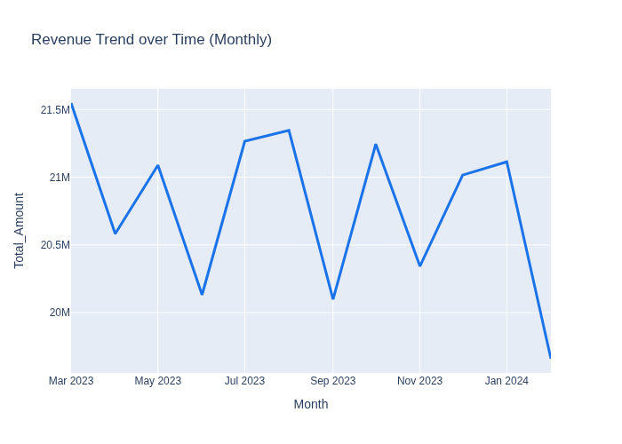
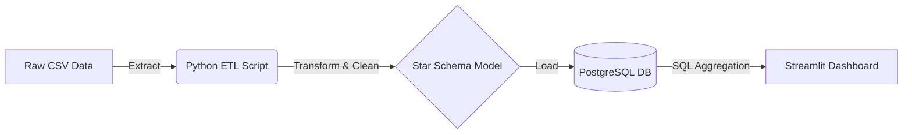
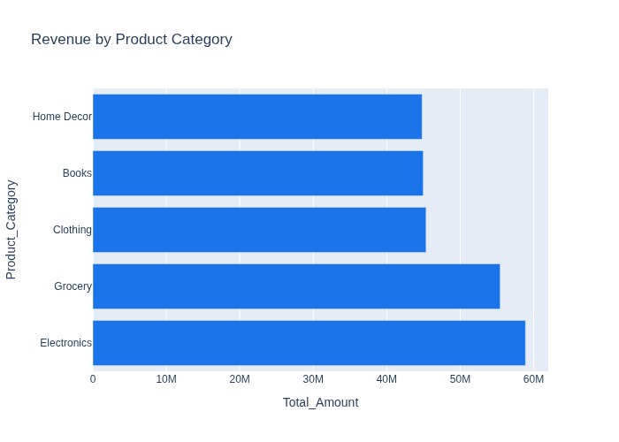
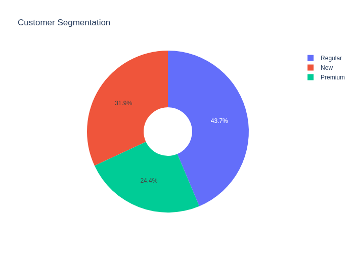

# 🛒 Retail Analytics Data Warehouse & BI Dashboard

 
 


An end-to-end data engineering and business intelligence framework designed to process and visualize large-scale retail transactional data. This repository contains the complete Extract, Transform, Load (ETL) pipeline and a multi-page interactive dashboard tailored for executive decision-making.

<br>

<div align="center">
  
</div>

---

## 📖 Table of Contents
1. [Business Case & Overview](#-business-case--overview)
2. [Data Architecture & Modeling](#-data-architecture--modeling)
3. [Dashboard Metrics Deep-Dive](#-dashboard-metrics-deep-dive)
4. [Getting Started (Deployment)](#-getting-started-deployment)

---

## 💼 Business Case & Overview

As retail operations scale across multiple regions, traditional manual reporting limits visibility, hindering data-driven actions. The goal of this project is to eliminate fragmented data silos by building a centralized, **Star-Schema Data Warehouse** running on PostgreSQL. 

By employing a fully containerized architecture, the pipeline robustly handles hundreds of thousands of concurrent transactions—normalizing anomalies, computing advanced metrics (Customer LTV, NPS), and powering a **Looker Studio-inspired Streamlit application** for instantaneous insights.

---

## 🏗 Data Architecture & Modeling

The project employs a highly reproducible **ETL (Extract → Transform → Load)** architecture designed for idempotency.



### 1. Robust Transformation & Cleaning
- **Data Validation:** Implements statistical null inferences via modes/medians, dynamic type-casting, and rigorous outlier bounding.
- **Data Standardization:** Solves typographical input errors (e.g., brand standardizations) and extracts powerful chronological elements (Day of Week, Quarters) directly from timestamps.

### 2. Star-Schema Design
The warehouse is normalized to optimize analytical querying:
- **`fact_transactions`**: The central nervous system logging transactional mappings, precise unit pricing boundaries, and operational boolean flags (e.g., `is_delivered`, `is_cancelled`).
- **`dim_customers`**: Enriched with computed metrics including **Lifetime Value (LTV)**, VIP segmentation tiers, and demographic distributions.
- **`dim_products`**: Captures sales velocity, computed aggregate ratings, and designated premium pricing tiers.
- **`dim_geography` & `dim_logistics`**: Segregates delivery mechanisms, feedback sentiments, and localized hubs.

---

## 📊 Dashboard Metrics Deep-Dive

The Business Intelligence dashboard is segmented into three distinct verticals to serve varying stakeholder requirements:

<div align="center">
  
</div>

### 1. Executive Summary
Provides a high-level operational overview for the C-Suite.
- **KPI Scorecards:** Total Revenue, Transaction Volume, Average Order Value (AOV), Unique Customers, and Aggregate Sentiment.
- **Visuals:** Monthly revenue growth matrices, top-grossing category bar distributions, and an Order Dispatch Health donut chart ensuring fulfillment stability.

### 2. Customer Intelligence
A dedicated CRM module focused exclusively on long-term behavioral profiling and predicting loyalty.
- **Customer Lifetime Value (LTV) & VIP Status:** Dynamic tiering partitioning customers into value bands based on longitudinal spend.
- **Repeat Purchase Cohorts:** Analyzing loyalty mechanics and tracking demographic correlations mapping customer income directly against expenditure patterns.

<div align="center">
  
</div>

### 3. Operations & Logistics
Evaluates the "cost to serve" and real-world supply chain efficiency.
- **Core Operations:** Tracks Delivery Rates, systemic Cancellations, and Same-Day shipping compliance.
- **Bottleneck Identification:** Utilizes dense correlation heatmaps to visualize dependencies between specific shipping providers and internal fulfillment delays.

---

## 🚀 Getting Started (Deployment)

This project has been engineered to leverage **Docker Compose** for a flawless, zero-configuration deployment. No local database installations are required.

### Prerequisites
- [Docker](https://docs.docker.com/get-docker/) and Docker Compose installed on your host machine.

### Step 1: Boot the Infrastructure
From the root directory of the repository, execute:
```bash
docker-compose up --build -d
```
> **What happens under the hood?**  
> 1. A bare-metal PostgreSQL 15 database is instantiated.  
> 2. A custom Python 3.11 environment is built and linked.  
> 3. An intelligent `entrypoint.sh` blocks downstream execution until the persistence layer is receptive.  
> 4. The `src/etl.py` script normalizes the mock dataset (300k+ rows) and seeds the database.  
> 5. Finally, the Streamlit service binds to port `8501`.  

### Step 2: Track Pipeline Execution
To monitor the ETL data ingestion process in real-time, inspect the container logs:
```bash
docker-compose logs -f
```

### Step 3: Access the Dashboard
Once the Streamlit service acknowledges a successful boot, open your web browser and navigate to the Command Center:
🌐 **`http://localhost:8501/`**

### Step 4: Graceful Shutdown
To cleanly stop the application and free up allocated host ports:
```bash
docker-compose down
```
*(Note: Database volumes persist automatically inside Docker via the configured `postgres_data` volume)*
